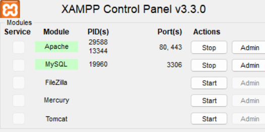
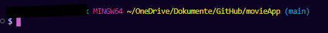
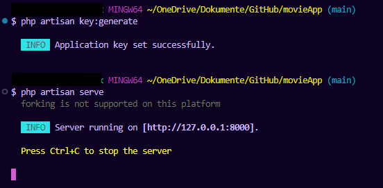

# Start Laravel Project Guide

### 1. Open GitBash-Terminal

### 2. Start XAMPP

### 3. Change directory to the movieApp in the Bash-Terminal

### 4. Enter following commands in the Bash-Terminal

\$ `php artisan key:generate`  
\$ `php artisan serve`

output:  

### The Website is now running on http://127.0.0.1:8000
